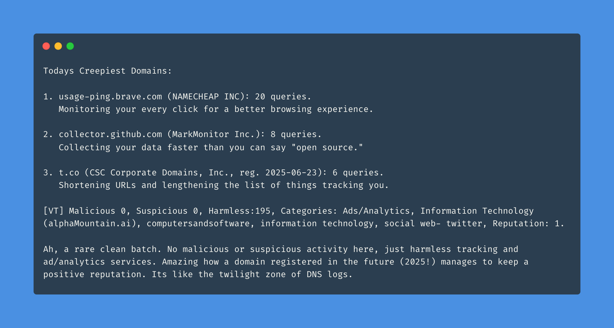
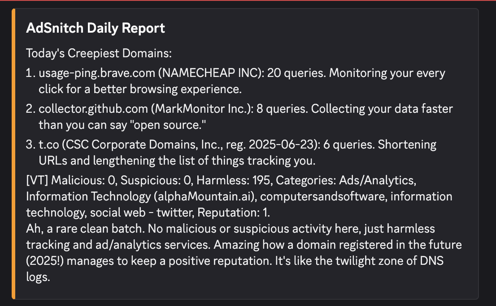

# AdSnitch
_Your privacy-loving, roast-delivering Discord tattletale for DNS logs — powered by local LLMs and a sense of humor._



## What is AdSnitch?

AdSnitch is a satirical Discord bot that spies on your Pi-hole or AdGuard Home logs and delivers **daily roast-style summaries** of blocked DNS requests. Think of it as your passive-aggressive network admin with a flair for drama, powered by local LLMs like Deepseek-R1:8B via Ollama. It’s like having a snarky IT guy in your Discord, but with less coffee and more existential dread — and it works entirely offline.

Every day, AdSnitch reports:
- The worst offenders (looking at you, `telemetry.yourTV.com`)
- Suspicious patterns (`why-do-you-need-20-ad-requests-in-a-minute.com`)
- Absurd domains you didn't know existed (and probably wish you still didn’t)
- Security and reputation info from VirusTotal (optional, for extra paranoia)
- And all this, with a generous sprinkle of snark, sarcasm, and LLM-generated wit

## Why?

Because knowing that your smart fridge is trying to contact 12 tracking domains daily *deserves commentary*.
Because laughter is the best firewall.
Because privacy matters — and AdSnitch can run 100% locally, with no cloud required.
Because your router’s sense of humor is non-existent.

## Features

- **Daily summaries** of DNS blocklists, so you can start your day with existential dread
- **Powered by Deepseek-R1:8B (or any Ollama model)** — runs locally, no internet required
- **Discord bot** integration with clean embeds (and even cleaner sarcasm)
- Supports **Pi-hole** and **AdGuard Home** as data sources
- Fully customizable tone: sarcastic sysadmin, conspiracy uncle, optimistic intern, grumpy engineer, or poet
- **Domain intelligence** lookup via **VirusTotal** for context-aware, security-focused summaries (optional, but highly recommended for extra insights)
- If no Discord token is provided, summaries are printed to the console (for the truly friendless)
- No cloud LLM required — but you can use OpenAI as a fallback if you want

## Screenshot

See how AdSnitch roasts your network right in Discord:



## How it Works

1. Parse DNS logs from Pi-hole / AdGuard Home (via API or log scrape).
2. Aggregate daily request data (blocked domains, counts, time trends).
3. Optionally look up domain details and security reputation via VirusTotal (for extra context and paranoia).
4. Use Deepseek-R1:8B (or any Ollama model) to craft a satirical summary — all locally, no internet needed.
5. Send the report as a Discord embed (or print to console if Discord is not configured).

For development, the `data/mock_logs.json` file mimics Pi-hole/AdGuard output. A simple plugin reads this data so you can test without a real DNS filter (or friends).

## Installation

```bash
git clone https://github.com/babanomania/adsnitch.git
cd adsnitch
npm install
cp .env.example .env   # Set up your bot token, Pi-hole/AdGuard, and (optionally) VirusTotal details
# Make sure you have Ollama and your model (e.g., deepseek-r1:8b) running locally
npm start
```

Source code is organized under `src/` with test data in `data/`.

## Configuration

| Variable              | Description                                  |
| --------------------- | -------------------------------------------- |
| `DISCORD_TOKEN`       | Your Discord bot token                       |
| `DISCORD_CHANNEL`     | Discord channel ID for reports               |
| `PIHOLE_URL`          | Pi-hole API or log file path                 |
| `ADGUARD_URL`         | (Optional) AdGuard Home API base URL         |
| `ADGUARD_USER`        | (Optional) AdGuard Home username             |
| `ADGUARD_PASS`        | (Optional) AdGuard Home password             |
| `OLLAMA_MODEL`        | Name of the Ollama model to use (e.g., deepseek-r1:8b, llama2, phi3, etc.) |
| `REPORT_TIME`         | Time of day to send daily summaries (HH:MM)  |
| `VIRUSTOTAL_API_KEY`  | (Optional) API key for VirusTotal domain intelligence |
| `OPENAI_API_KEY`      | (Optional) Use OpenAI for summaries if you want cloud fallback |
| `PERSONALITY`         | Personality mode for summaries: sysadmin, conspiracy_uncle, optimistic_intern, grumpy_engineer, poet |
| `SUMMARY_TOP_N`       | Number of top domains to include in summary  |

The repo includes sample data in `data/mock_logs.json` for local testing. Because sometimes you want to test your bot without actually blocking anything.

By default, domain metadata and security info is pulled from VirusTotal if you provide an API key. If you want maximum privacy, just leave it blank — AdSnitch will still work, but with less context.

## Personality Modes

AdSnitch can roast your network in a variety of styles. Set the `PERSONALITY` variable in your `.env` to choose:

- **sysadmin**: World-weary, sarcastic system administrator.
- **conspiracy_uncle**: Paranoid uncle who sees a plot in every packet.
- **optimistic_intern**: Cheerful, naive tech support intern.
- **grumpy_engineer**: Old-school, grumbling network engineer.
- **poet**: Lyrical AI that turns your DNS logs into poetry.

### Example Summaries

**sysadmin**
```
1. ads.doubleclick.net (Google): 42 queries. The ad overlords never sleep.
2. telemetry.myapp.com (MyApp Inc.): 30 queries. Because your toaster needs to phone home.
3. shady-domain.xyz (Unknown): 5 queries. If you have to ask, you can't afford the ransomware.
[VT] Malicious: 2, Suspicious: 1, Harmless: 19, Categories: Advertising, Analytics, Malware, Reputation: -5.
So, in summary: Two domains are just here to sell you things or spy on you, but at least one is actively malicious. Reputation is in the gutter, categories range from "Advertising" to "Malware"—a real DNS hall of shame. Sleep tight.
```

**conspiracy_uncle**
```
1. ads.doubleclick.net (Google): 42 queries. Classic. The ad overlords are tracking your every move, probably to implant subliminal messages.
2. telemetry.myapp.com (MyApp Inc.): 30 queries. "Telemetry"? More like "spying for the deep state."
3. shady-domain.xyz (Unknown): 5 queries. This is where the real secrets are hidden.
[VT] Malicious: 2, Suspicious: 1, Harmless: 19, Categories: Advertising, Analytics, Malware, Reputation: -5.
See? The numbers don’t lie. Malicious domains, analytics, malware—this is all part of a global plot to control your toaster. Connect the dots, sheeple!
```

**optimistic_intern**
```
1. ads.doubleclick.net (Google): 42 queries. Wow, so many connections! Google must be working hard to keep us informed.
2. telemetry.myapp.com (MyApp Inc.): 30 queries. Data helps make things better!
3. shady-domain.xyz (Unknown): 5 queries. Everyone deserves a chance, even new domains!
[VT] Malicious: 2, Suspicious: 1, Harmless: 19, Categories: Advertising, Analytics, Malware, Reputation: -5.
Sure, there are a couple of warnings, but most domains are harmless! Technology is amazing, and we’re learning every day!
```

**grumpy_engineer**
```
1. ads.doubleclick.net (Google): 42 queries. Used to be we just had spam. Now it’s all ads, all the time.
2. telemetry.myapp.com (MyApp Inc.): 30 queries. Back in my day, software didn’t need to call home every five minutes.
3. shady-domain.xyz (Unknown): 5 queries. This is why we can’t have nice things.
[VT] Malicious: 2, Suspicious: 1, Harmless: 19, Categories: Advertising, Analytics, Malware, Reputation: -5.
Modern networks are a mess. Too many threats, not enough common sense. Bring back BBSes and floppy disks.
```

**poet**
```
1. ads.doubleclick.net (Google):
Ad banners bloom bright,
Forty-two calls in the night,
Google’s endless light.
2. telemetry.myapp.com (MyApp Inc.):
Data flows like streams,
Thirty pings to distant dreams,
Hopeful, so it seems.
3. shady-domain.xyz (Unknown):
Shadows on the net,
Five queries, secrets unmet,
Caution, don’t forget.
[VT] Malicious: 2, Suspicious: 1, Harmless: 19, Categories: Advertising, Analytics, Malware, Reputation: -5.
Malice in the wires,
Yet harmless traffic as well,
Balance lost and found.
```

## FAQ

**Q: Does AdSnitch require an internet connection?**
A: Nope! If you use Ollama and a local model like Deepseek, everything runs on your machine. No cloud, no data leaks, just pure local snark.

**Q: What does VirusTotal add?**
A: If you provide a VirusTotal API key, AdSnitch will enrich your summaries with security and reputation info for each domain. It’s optional, but gives you more insight (and more reasons to worry).

**Q: Can I use OpenAI instead?**
A: Yes, just set your `OPENAI_API_KEY` in `.env` and AdSnitch will use OpenAI as a fallback if your local model isn’t available.

## License

MIT. Just don’t use this to actually manage DNS security. It’s here for fun and giggles. If you run this in production, you deserve whatever happens.

## Contribute

Pull requests welcome. Add your own flavor of sarcasm to the bot. Bonus points for puns.

## Disclaimer

AdSnitch is not responsible if your coworkers start relying on it more than actual monitoring tools. Or if your smart fridge becomes self-aware.

---

> *“If it’s blocked, AdSnitch is watching… and judging.”*
